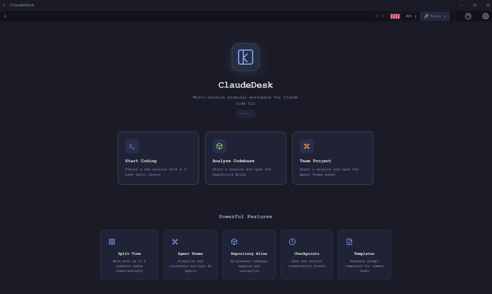
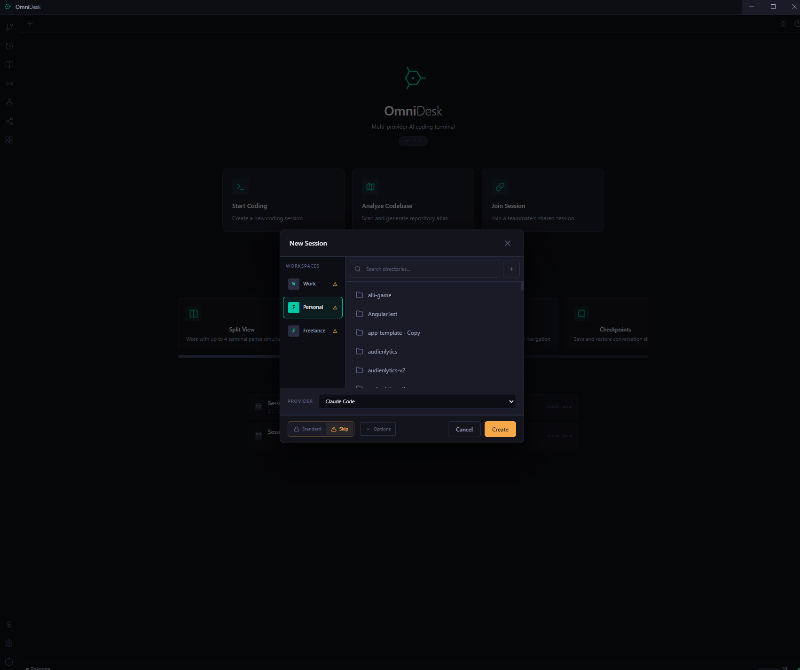
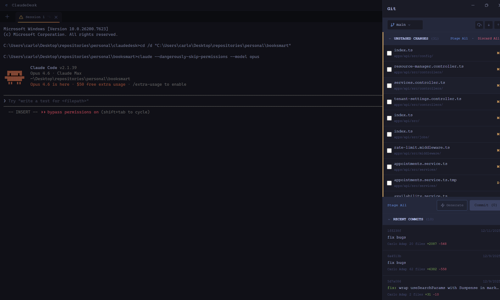
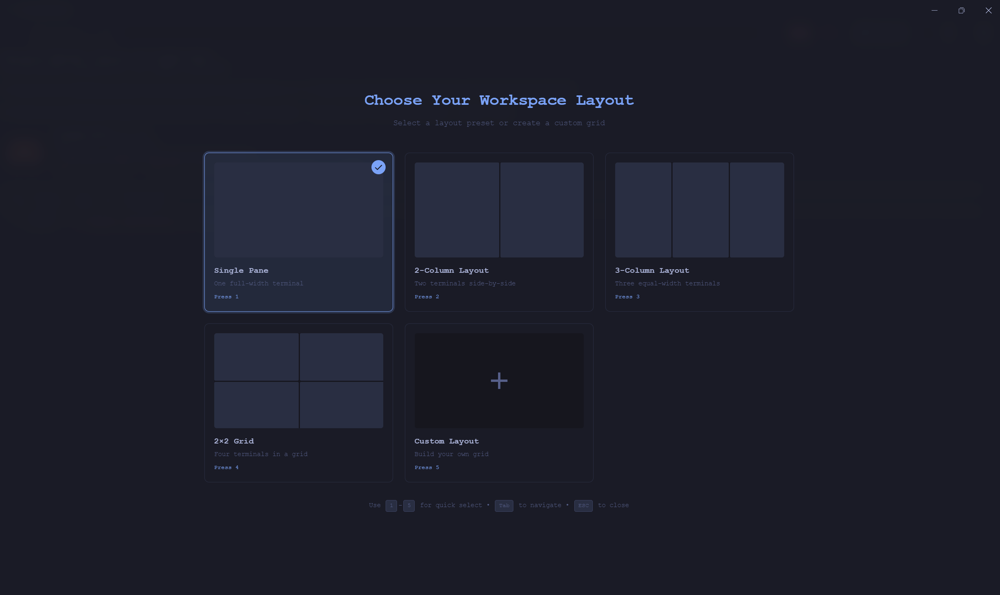
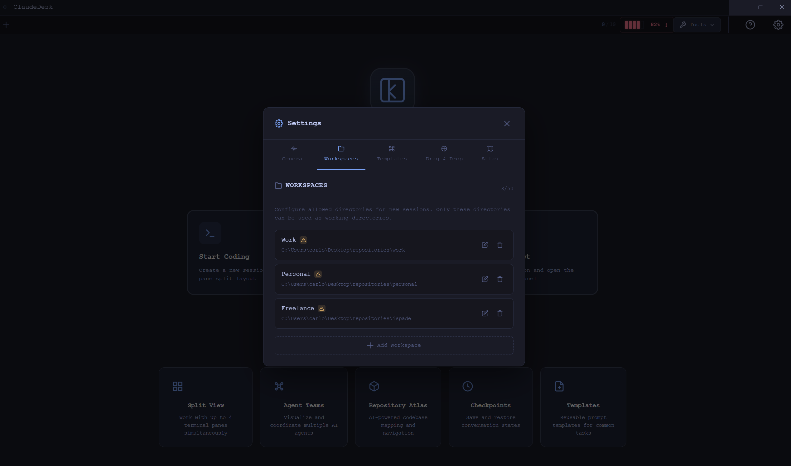
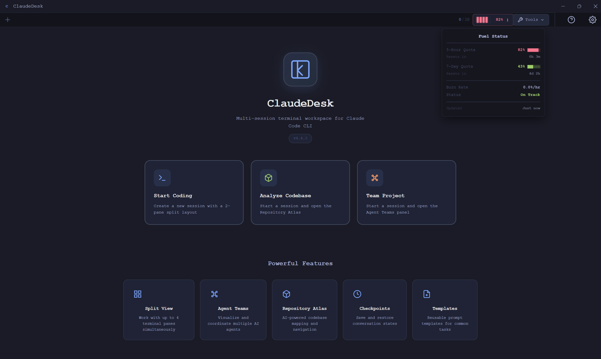
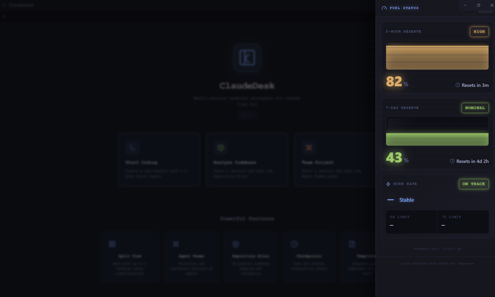

# ClaudeDesk


> A powerful desktop terminal for Claude Code CLI with multi-session management, split-view layouts, and advanced productivity features.

**ClaudeDesk** is an Electron-based desktop application that wraps the Claude Code CLI in a feature-rich terminal interface. Manage multiple Claude sessions simultaneously, organize your workspace with split views, use prompt templates, and monitor your API usage — all in one beautiful desktop app.



---

## Screenshots

<table>
<tr>
<td width="50%">

**Create Session** — Workspace-aware session creation with directory search and permission modes.



</td>
<td width="50%">

**Git Integration** — Built-in git panel with file staging, inline diffs, AI commit messages, and history.



</td>
</tr>
<tr>
<td width="50%">

**Workspace Layouts** — Choose from preset layouts or build a custom grid with up to 4 panes.



</td>
<td width="50%">

**Settings & Workspaces** — Configure workspaces, templates, drag-and-drop, atlas, and more.



</td>
</tr>
<tr>
<td width="50%">

**Fuel Status Popup** — Quick glance at API quota from the toolbar.



</td>
<td width="50%">

**Fuel Status Panel** — Detailed 5-hour and 7-day reserves with burn rate tracking.



</td>
</tr>
</table>

---

## Features

### Multi-Session Management
- **Multiple Claude sessions** in tabbed interface
- **Session persistence** — resume sessions after app restart
- **Named sessions** for better organization
- **Session history** — search and export conversation logs
- **Checkpoints** — save and restore session states

### Split-View Terminal
- **Split screen** support with up to 4 terminal panes
- **Flexible layouts** — horizontal, vertical, and grid splits
- **Layout picker** — preset layouts (single, 2-column, 3-column, 2x2) or custom grids
- **Drag-and-drop** session assignment to panes

### Git Integration
- **Full git workflow** — status, staging, branches, commit, push/pull/fetch, diff, log
- **AI commit messages** — heuristic-based conventional commits generation
- **Real-time file watching** — status updates automatically as you work
- **Keyboard shortcut** `Ctrl+Shift+G` and staged count badge in toolbar

### Prompt Templates & Command Palette
- **Keyboard shortcut** (`Ctrl/Cmd+Shift+P`) to launch command palette
- **Prompt template library** for common tasks
- **Variable substitution** — `{{clipboard}}`, `{{currentDir}}`, `{{selection}}`, etc.
- **Custom templates** — create and edit your own
- **Fuzzy search** for quick template access

### API Quota Monitoring
- **Real-time quota display** — see your Claude API usage at a glance
- **Burn rate tracking** — monitor spending over time
- **Budget alerts** — get notified when approaching limits
- **Fuel gauge** in toolbar with detailed popup and side panel

### Agent Teams
- **Automatic team detection** — monitors `~/.claude/teams/` for agent team activity
- **Team Panel** — sidebar showing team hierarchy, members, and status
- **Task Board** — Kanban-style visualization with per-team tasks
- **Message Stream** — real-time inter-agent communication feed
- **Agent Graph** — interactive node-based relationship visualization
- **Auto-layout** — automatically arranges panes when teammates join


### Repository Atlas Engine
- **Automated codebase mapping** — scans files, analyzes imports, infers domain boundaries
- **CLAUDE.md generation** — creates architectural atlas for AI tools to navigate the repo
- **Domain-to-file index** — generates `docs/repo-index.md` with per-domain file tables
- **Preview and approve** — review generated content before writing to disk

### Terminal Features
- **Full xterm.js terminal** with rich text formatting
- **Clickable links** — URLs automatically detected
- **Copy/paste support** with keyboard shortcuts
- **Tokyo Night dark theme** with JetBrains Mono font
- **Drag-and-drop** file insertion into terminal

---

## Prerequisites

Before installing ClaudeDesk, ensure you have:

1. **Node.js 20+** — [Download here](https://nodejs.org/)
2. **Claude Code CLI** — Install via:
   ```bash
   npm install -g @anthropic-ai/claude-code
   ```
   Or follow the [official installation guide](https://claude.ai/claude-code)
3. **Claude API credentials** — ClaudeDesk reads from `~/.claude/.credentials.json` (set up by Claude CLI)

---

## Installation

### Option 1: Download Pre-built Binary (Recommended)

Download the latest release for your platform from the [Releases](https://github.com/carloluisito/claudedesk/releases) page.

- **Windows**: `.exe` installer
- **macOS**: `.dmg`
- **Linux**: `.AppImage` or `.deb`

### Option 2: Build from Source

```bash
# Clone the repository
git clone https://github.com/carloluisito/claudedesk.git
cd claudedesk

# Install dependencies
npm install

# Run in development mode
npm run electron:watch

# Or build for production
npm run package
```

**Build for specific platforms:**
```bash
npm run package:win    # Windows
npm run package:mac    # macOS
npm run package:linux  # Linux
```

Built packages will be in the `release/` directory.

---

## Quick Start

1. **Launch ClaudeDesk** from your applications menu or run `npm run electron:watch`
2. **Create your first session** — click "+" or press `Ctrl+T`, pick a workspace and directory
3. **Start using Claude** — type your prompt in the terminal
4. **Try the command palette** — press `Ctrl+Shift+P` to browse prompt templates
5. **Enable split view** — use the layout picker or click split controls in the pane header

---

## Keyboard Shortcuts

| Shortcut | Action |
|----------|--------|
| `Ctrl+T` | New Session |
| `Ctrl+W` | Close Current Session |
| `Ctrl+Tab` | Next Session Tab |
| `Ctrl+Shift+Tab` | Previous Session Tab |
| `Ctrl+Shift+P` | Open Command Palette |
| `Ctrl+Shift+G` | Open Git Panel |
| `Ctrl+,` | Open Settings |
| `Ctrl+C` | Session Termination Dialog |

---

## Tech Stack

| Layer | Technology |
|-------|-----------|
| Framework | Electron 28 |
| Frontend | React 18 + TypeScript |
| Terminal | xterm.js + node-pty |
| Styling | Tailwind CSS (Tokyo Night theme) |
| Graph | reactflow |
| Build | Vite + electron-builder |
| Testing | Vitest 4 (233 tests) + Playwright |

---

## Project Structure

```
claudedesk/
├── src/
│   ├── main/              # Electron main process (9 managers)
│   ├── preload/           # Context bridge (auto-derived from contract)
│   ├── renderer/          # React app (hooks, components, utils)
│   └── shared/            # IPC contract, types, shared utilities
├── test/                  # Test setup and helpers
├── e2e/                   # Playwright E2E tests
├── docs/                  # Documentation and screenshots
└── .github/workflows/     # CI pipeline
```

See [docs/repo-index.md](docs/repo-index.md) for a detailed domain-to-file mapping.

---

## Development

```bash
npm install              # Install dependencies
npm run electron:watch   # Dev mode with hot reload
npm test                 # Run all 233 tests
npm run test:watch       # Watch mode
npm run test:e2e         # E2E tests (local only)
npm run test:coverage    # Coverage report
```

See [CONTRIBUTING.md](CONTRIBUTING.md) for development guidelines.

---

## Privacy & Security

- **Local-first** — all session data stored on your machine
- **No telemetry** — no usage data collected or transmitted
- **No third-party services** — only communicates with Anthropic's official API
- **Credential security** — reads Claude CLI credentials locally, never logs or stores them

For more details, see [SECURITY.md](SECURITY.md).

---

## Known Issues

- **Windows**: `cmd.exe` is used as the default shell. Ensure `claude` is in your PATH.
- **macOS**: Requires macOS 10.13+ (High Sierra or later).
- **Linux**: May require `libxtst6` and `libnss3` packages.

---

## Contributing

1. **Report bugs** — [Open an issue](https://github.com/carloluisito/claudedesk/issues/new?template=bug_report.md)
2. **Suggest features** — [Request a feature](https://github.com/carloluisito/claudedesk/issues/new?template=feature_request.md)
3. **Submit PRs** — See [CONTRIBUTING.md](CONTRIBUTING.md) for guidelines

Please read our [Code of Conduct](CODE_OF_CONDUCT.md) before contributing.

---

## License

This project is licensed under the **MIT License** — see the [LICENSE](LICENSE) file for details.

```
Copyright (c) 2026 Carlo Luisito Adap
```

---

## Disclaimer

**ClaudeDesk is an unofficial community project and is not endorsed, affiliated with, or supported by Anthropic.**

This is an independent wrapper around the Claude Code CLI. For official support, refer to [Anthropic's documentation](https://claude.ai/claude-code).

---

## Support

- **Issues**: [GitHub Issues](https://github.com/carloluisito/claudedesk/issues)
- **Security**: See [SECURITY.md](SECURITY.md) for reporting vulnerabilities
- **Email**: carlo.adap@hotmail.com

---

[](https://github.com/carloluisito/claudedesk/stargazers)

**Made with love by [Carlo Luisito Adap](https://github.com/carloluisito)**
