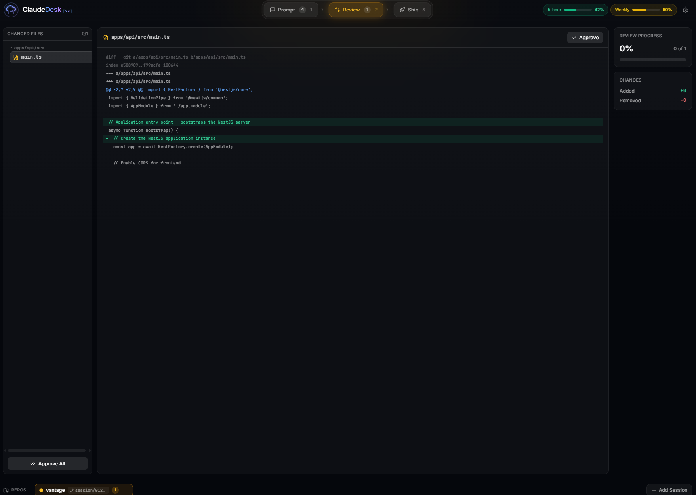
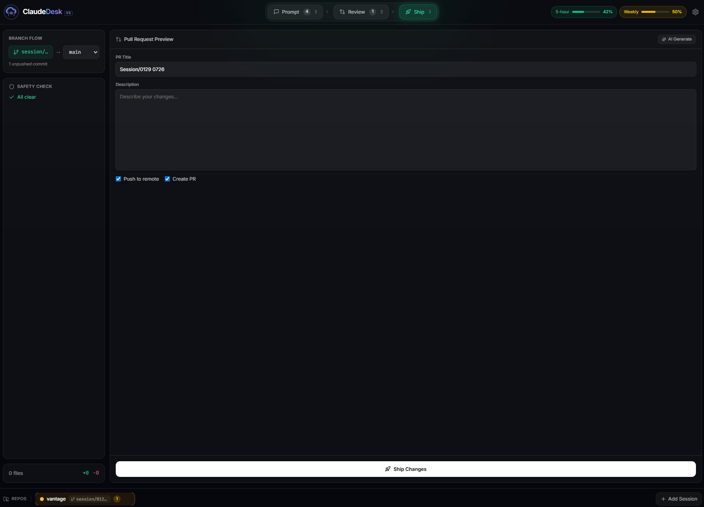

# ClaudeDesk

[](https://www.npmjs.com/package/claudedesk)
[](https://opensource.org/licenses/MIT)
[](https://nodejs.org/)

A web interface for Claude Code with session persistence, visual tool activity, and safe shipping workflows.

**See what Claude does. Review before you ship.**

### Screenshots


*Chat with Claude — conversation panel with visual tool activity timeline*


*Review changes — file-by-file diff viewer with per-file approval workflow*


*Ship safely — commit, push, and create PRs in a guided flow with safety checks*

## Important Security Information

**ClaudeDesk grants Claude Code autonomous access to your local file system and command execution.**

By default, Claude can:
- Read, edit, and delete files in configured workspaces
- Execute arbitrary shell commands on your machine
- Install packages and modify system configuration
- Access network resources and external APIs

**Before using ClaudeDesk:**
- Only configure trusted repositories in workspaces
- Review all changes before committing or deploying
- Use read-only permission mode when exploring unfamiliar codebases
- Keep ClaudeDesk bound to localhost (default) unless you specifically need remote access
- Never configure system directories or sensitive paths
- Never run ClaudeDesk with elevated privileges unless absolutely necessary

ClaudeDesk is designed for development environments. Use production deployments with caution.

## What is ClaudeDesk?

ClaudeDesk is a companion interface for developers who already use Claude Code CLI. It provides visual oversight of AI actions, persistent sessions you can resume anytime, and a structured workflow for reviewing and shipping changes safely.

It is not an IDE. It is not a replacement for Claude Code. It is a session manager that gives you control and visibility.

## Features

- **Session Management** - Create, persist, resume, search, and export Claude Code sessions
- **Visual Tool Timeline** - See every Read, Edit, Bash action in real-time as Claude works
- **Git Worktree Isolation** - Each session runs in its own worktree branch for safe experimentation
- **Ship Workflow** - Review diffs file-by-file, approve changes individually or in bulk, then commit, push, and create PRs in a guided flow with visual progress tracking
- **Multi-Repo Sessions** - Work across multiple repositories from a single interface
- **Quota Tracking** - Monitor your Claude API usage and costs
- **GitHub/GitLab OAuth** - Push and create PRs using OAuth tokens
- **Plan Mode** - Review and approve Claude's plan before execution
- **Message Queue** - Queue up to 10 messages while Claude is working, with queue manager to preview, reorder, and remove pending prompts
- **Stop/Cancel** - Stop Claude mid-generation with Escape key or Stop button; partial responses are preserved with cancellation marker
- **Queue Resume Controls** - After stopping, choose to resume queue processing or clear all pending messages
- **MCP Server Integration** - Configure and manage MCP servers for external tools (GitHub, PostgreSQL, Slack, and more). Tool invocation during sessions coming soon.

## File Review & Approval

Before shipping changes, ClaudeDesk requires you to review and approve each modified file. This safety feature ensures you've seen every change before it hits your repository.

### Status Indicators

| Color | Meaning |
|-------|---------|
| Green dot | File created/added |
| Yellow dot | File modified |
| Red dot | File deleted |
| Blue dot | File renamed |

### Approval Options

1. **Per-file**: Click the "Approve" button in the diff viewer header
2. **Bulk**: Click "Approve All Files" in the summary panel
3. **From list**: Click the approval badge next to any file

The "Proceed to Ship" button becomes active only after all files are approved. A progress bar shows your approval completion percentage.

## MCP Server Integration

ClaudeDesk supports the [Model Context Protocol (MCP)](https://modelcontextprotocol.io/), allowing Claude to interact with external tools and services.

### What is MCP?

MCP is an open protocol that enables AI assistants to securely connect to external data sources and tools. With MCP servers, Claude can:
- Query databases directly
- Interact with GitHub repositories and issues
- Send Slack messages
- Access file systems
- And much more

### Quick Start

1. Go to **Settings > MCP Servers**
2. Click **Browse Catalog** to see available servers
3. Select a server (e.g., GitHub, PostgreSQL)
4. Follow the setup wizard to configure credentials
5. The server connects automatically when enabled

### Supported Transports

| Transport | Description | Use Case |
|-----------|-------------|----------|
| **stdio** | Command-based, runs locally | Local tools, databases, file access |
| **SSE** | HTTP-based, can be remote | Remote services, cloud APIs |

### Catalog Servers

ClaudeDesk includes a catalog of 15 pre-configured MCP servers:

| Server | Category | Description |
|--------|----------|-------------|
| GitHub | Development | Repository management, issues, PRs |
| GitLab | Development | GitLab API integration |
| PostgreSQL | Database | Direct SQL queries |
| MySQL | Database | MySQL database access |
| SQLite | Database | Local SQLite databases |
| Redis | Database | Redis key-value operations |
| MongoDB | Database | MongoDB document queries |
| Slack | Communication | Send/receive Slack messages |
| Notion | Productivity | Notion pages and databases |
| Linear | Productivity | Issue tracking and project management |
| Figma | Design | Design file access and inspection |
| Sentry | Monitoring | Error tracking and debugging |
| Puppeteer | Automation | Browser automation and screenshots |
| Filesystem | Utilities | Extended file system access |
| Memory | Utilities | Persistent memory across sessions |

### Manual Server Configuration

For servers not in the catalog:

1. Click **Add Server** in Settings > MCP Servers
2. Enter server details:
   - **Name**: Display name
   - **Transport**: stdio or SSE
   - **Command** (stdio): The command to run (e.g., `npx @modelcontextprotocol/server-github`)
   - **URL** (SSE): The server endpoint URL
   - **Environment Variables**: API keys and credentials

### Security Considerations

- API keys and tokens are stored encrypted locally
- Each server runs in isolation
- Tool calls require explicit approval (configurable)
- Servers can be enabled/disabled without deletion

### Current Limitations

> **Note:** MCP server management and tool discovery are fully functional. However, **MCP tools are not yet available to Claude during terminal sessions**. Claude cannot autonomously invoke MCP tools while working on your tasks. This integration is planned for a future release.
>
> Current capabilities:
> - Configure and manage MCP servers
> - Connect/disconnect servers
> - View discovered tools
> - Monitor connection status in terminal
>
> Coming soon:
> - Claude invoking MCP tools during conversations
> - Tool approval workflow during sessions
> - Tool activity in the timeline

## Keyboard Shortcuts

| Shortcut | Action |
|----------|--------|
| **Escape** | Stop Claude's current generation (preserves partial response) |
| **Enter** | Send message (in composer) |
| **Shift+Enter** | New line in composer |

## Installation

### Option 1: npm (Recommended)

```bash
# Install globally
npm install -g claudedesk
claudedesk

# Or run without installing
npx claudedesk
```

**Note:** The browser opens automatically when you run `claudedesk`. Use `--no-open` to disable this.

**Prerequisites:** Node.js 18+ and [Claude Code CLI](https://docs.anthropic.com/en/docs/claude-code)

**For MCP Servers:** Some MCP servers require additional tools:
- `npx` (included with npm 5.2+) - Required for most catalog servers
- `uvx` (from [uv](https://github.com/astral-sh/uv)) - Required for Python-based MCP servers

### Option 2: Docker

```bash
cd deploy
cp .env.example .env
docker compose up -d
```

See [deploy/README.md](deploy/README.md) for full Docker deployment instructions.

**Prerequisites:** Docker Engine 20.10+ and Docker Compose 2.0+

### Install as Desktop App (PWA)

ClaudeDesk is a Progressive Web App. After launching it from npm or Docker, you can install it as a standalone desktop app from your browser. Once installed, it appears in your app launcher / Start Menu / Dock like any native application.

**Google Chrome / Microsoft Edge (Windows, macOS, Linux)**

1. Run `claudedesk` (the browser opens automatically)
2. Look for the install icon in the address bar (a monitor with a down arrow, or a "+" icon)
3. Click it and select **"Install"**
4. ClaudeDesk opens in its own window without browser chrome

Alternatively: click the **three-dot menu (...)** > **"Install ClaudeDesk"** (Chrome) or **"Apps" > "Install this site as an app"** (Edge).

**Where the app appears after install:**

| Platform | Location |
|----------|----------|
| **Windows** | Start Menu, Taskbar (pin it), Desktop shortcut |
| **macOS** | Launchpad, Applications folder, Dock (pin it) |
| **Linux** | Application menu (GNOME, KDE, etc.) |

**Uninstalling the PWA:**

- **Chrome/Edge**: Open the installed app > click the three-dot menu in the title bar > **"Uninstall ClaudeDesk"**
- **Windows**: Settings > Apps > Installed Apps > ClaudeDesk > Uninstall
- **macOS**: Finder > Applications > right-click ClaudeDesk > Move to Trash

**Notes:**
- The PWA requires the `claudedesk` server to be running. Launch `claudedesk` from your terminal before opening the app, or set it to run on login using your OS startup settings.
- The PWA caches UI assets for faster loading but requires the local ClaudeDesk server to be running for all functionality. It does not work offline.
- On mobile devices, use the **"Add to Home Screen"** option from your browser's share menu when accessing ClaudeDesk via a tunnel.

### Option 3: From Source (Development)

```bash
git clone https://github.com/carloluisito/claudedesk.git
cd claude-desk
npm install
npm run dev
```

**Prerequisites:** Node.js 18+, npm, Git, and [Claude Code CLI](https://docs.anthropic.com/en/docs/claude-code)

## CLI Reference

```
claudedesk [options]

Options:
  --port <port>          Port to listen on (default: 8787)
  --data-dir <path>      Data directory for config and artifacts
  --skip-wizard          Skip the initial setup wizard
  --allow-remote         Allow remote network access (binds to 0.0.0.0)
  --no-open              Don't auto-open the browser on startup
  --check-update         Check for a newer version and exit
  --update               Check and install update if available, then exit
  --clear-cache [type]   Clear cached data and exit (types: sessions, artifacts, worktrees, usage, all)
  -h, --help             Show help message
  -v, --version          Show version number
```

### Examples

```bash
# Start on default port
claudedesk

# Start on custom port
claudedesk --port 3000

# Use custom data directory
claudedesk --data-dir /opt/claudedesk-data

# Skip setup wizard (for automated deployments)
claudedesk --skip-wizard

# Allow remote access (see security warning below)
claudedesk --allow-remote --port 8080
```

### Remote Access Security Warning

By default, ClaudeDesk binds to `127.0.0.1` (localhost only). Using `--allow-remote` binds to `0.0.0.0`, exposing ClaudeDesk to your entire network.

**Risks of `--allow-remote`:**
- Anyone on your network can access the ClaudeDesk interface
- With your auth token, they can access your configured repositories
- Claude can execute arbitrary commands on your machine
- Your code and file system are exposed

**Only use `--allow-remote` when:**
- You are on a trusted private network
- You have additional authentication/firewall in place
- You specifically need mobile or remote access

**Safer alternative:** Use the built-in tunnel feature for secure remote access without exposing your local network.

## Configuration

### Data Directory

ClaudeDesk stores all configuration and data in a dedicated directory:

**Default locations:**
- Linux/macOS: `~/.claudedesk`
- Windows: `%APPDATA%\claudedesk`

**Custom location:**
```bash
claudedesk --data-dir /custom/path
# Or via environment variable
export CLAUDEDESK_DATA_DIR=/custom/path
```

**Directory structure:**
```
.claudedesk/
  config/
    settings.json          # App settings
    repos.json             # Repository configuration
    workspaces.json        # Workspace definitions
    mcp-servers.json       # MCP server configurations (auto-created)
    terminal-sessions.json # Persisted session data
    skills/                # Custom Claude skills
    usage/                 # API usage tracking
  artifacts/               # Session artifacts and exports
```

### Environment Variables

ClaudeDesk can be configured via environment variables:

| Variable | Default | Description |
|----------|---------|-------------|
| `CLAUDEDESK_PORT` | 8787 | Port to listen on |
| `CLAUDEDESK_DATA_DIR` | `~/.claudedesk` | Data directory path |
| `CLAUDEDESK_TOKEN` | `claudedesk-local` | Override the auth token (use a strong value if exposed to a network) |
| `ALLOW_REMOTE` | false | Set to `true` for remote access |
| `GITHUB_CLIENT_ID` | - | GitHub OAuth client ID |
| `GITHUB_CLIENT_SECRET` | - | GitHub OAuth client secret |
| `GITLAB_CLIENT_ID` | - | GitLab OAuth client ID |
| `GITLAB_CLIENT_SECRET` | - | GitLab OAuth client secret |

Example:
```bash
CLAUDEDESK_PORT=3000 ALLOW_REMOTE=true claudedesk
```

### Workspaces

Configure your repositories in `config/repos.json` (inside your data directory):

```json
{
  "allowedBasePaths": ["/path/to/repos"],
  "repos": [
    {
      "id": "my-project",
      "path": "/path/to/repos/my-project"
    }
  ]
}
```

### GitHub OAuth (Optional)

To enable push and PR creation via OAuth:

1. Create a GitHub OAuth App at https://github.com/settings/developers
2. Set the callback URL to `http://localhost:<PORT>/api/auth/github/callback`
   - Replace `<PORT>` with your configured port (default: 8787)
3. Add credentials to your environment:

```bash
export GITHUB_CLIENT_ID=your_client_id
export GITHUB_CLIENT_SECRET=your_client_secret
```

### GitLab OAuth (Optional)

1. Create a GitLab Application at https://gitlab.com/-/user_settings/applications
2. Set the callback URL to `http://localhost:<PORT>/api/auth/gitlab/callback`
   - Replace `<PORT>` with your configured port (default: 8787)
3. Add credentials to your environment:

```bash
export GITLAB_CLIENT_ID=your_client_id
export GITLAB_CLIENT_SECRET=your_client_secret
```

### Claude API Token Configuration

ClaudeDesk can display your Claude API usage quota in the terminal interface. This requires access to your Claude OAuth token.

**Auto-detection (Recommended)**

If you have Claude Code CLI installed and authenticated, ClaudeDesk automatically detects your token from these locations:

- `~/.claude/.credentials.json` (standard)
- `~/.claude/.credentials` (Windows, no extension)
- `~/.claude/credentials.json` (legacy)

**Manual Configuration**

If auto-detection doesn't work (e.g., token stored elsewhere), you can manually configure it:

1. Go to **Settings > API Configuration**
2. Expand "How to Get Your Claude API Token" for instructions
3. Paste your token and click **Test Token**
4. If valid, click **Save Token**

The token is encrypted using AES-256-GCM before being stored locally.

**Token Priority**

When fetching usage quota, ClaudeDesk checks in this order:
1. Manual token from Settings (if configured)
2. Auto-detected token from credential files
3. No token (quota tracking disabled)

## API Reference

### Health Check

**GET `/api/health`**

Returns server health status and version information. Used for Docker healthchecks and monitoring.

```json
{
  "success": true,
  "data": {
    "status": "ok",
    "version": "3.0.0",
    "uptime": 12345,
    "timestamp": "2026-01-28T12:00:00.000Z"
  }
}
```

### Ship Workflow Endpoints

These endpoints power the commit, push, and PR creation workflow.

#### Get Ship Summary

**GET `/api/terminal/sessions/:id/ship-summary`**

Returns the current state of changes ready to ship.

Query parameters:
- `repoId` (optional) - For multi-repo sessions

```json
{
  "files": [
    {
      "path": "src/index.ts",
      "status": "modified",
      "insertions": 10,
      "deletions": 3,
      "oldPath": null
    }
  ],
  "totalInsertions": 10,
  "totalDeletions": 3,
  "currentBranch": "feature/my-feature",
  "baseBranch": "main",
  "hasUncommittedChanges": true,
  "hasChangesToShip": true,
  "unpushedCommits": 0,
  "hasStagedChanges": false,
  "hasUnstagedChanges": true,
  "existingPR": null
}
```

#### Generate PR Content

**POST `/api/terminal/sessions/:id/generate-pr-content`**

Uses AI to generate a PR title and description based on the changes.

Request body:
```json
{
  "repoId": "optional-repo-id",
  "targetBranch": "main"
}
```

Response:
```json
{
  "title": "Add user authentication flow",
  "description": "## Summary\n- Implements login/logout functionality\n- Adds session management\n\n## Changes\n- New auth middleware\n- Updated routes"
}
```

#### Ship Changes

**POST `/api/terminal/sessions/:id/ship`**

Commits, pushes, and optionally creates a PR.

Request body:
```json
{
  "commitMessage": "Add user authentication",
  "push": true,
  "createPR": true,
  "prTitle": "Add user authentication flow",
  "prBody": "## Summary\n...",
  "targetBranch": "main",
  "repoId": "optional-repo-id"
}
```

Response:
```json
{
  "success": true,
  "committed": true,
  "pushed": true,
  "prUrl": "https://github.com/user/repo/pull/123",
  "commitHash": "abc1234"
}
```

### MCP Server Endpoints

These endpoints manage MCP server configuration and connections.

#### List Servers

**GET `/api/mcp/servers`**

Returns all configured MCP servers.

```json
[
  {
    "id": "github-1",
    "name": "GitHub",
    "transport": "stdio",
    "command": "npx",
    "args": ["-y", "@modelcontextprotocol/server-github"],
    "env": { "GITHUB_TOKEN": "***" },
    "enabled": true,
    "autoConnect": true,
    "createdAt": "2026-01-28T12:00:00.000Z"
  }
]
```

#### Create Server

**POST `/api/mcp/servers`**

Creates a new MCP server configuration.

Request body:
```json
{
  "name": "GitHub",
  "transport": "stdio",
  "command": "npx",
  "args": ["-y", "@modelcontextprotocol/server-github"],
  "env": { "GITHUB_TOKEN": "ghp_xxx" },
  "enabled": true,
  "autoConnect": true
}
```

#### Update Server

**PUT `/api/mcp/servers/:id`**

Updates an existing server configuration.

#### Delete Server

**DELETE `/api/mcp/servers/:id`**

Removes a server configuration.

#### Get Server Status

**GET `/api/mcp/servers/:id/status`**

Returns the connection status and available tools.

```json
{
  "id": "github-1",
  "status": "connected",
  "tools": [
    { "name": "github_create_issue", "description": "Create a GitHub issue" },
    { "name": "github_list_repos", "description": "List repositories" }
  ],
  "connectedAt": "2026-01-28T12:00:00.000Z"
}
```

#### Connect Server

**POST `/api/mcp/servers/:id/connect`**

Establishes connection to an MCP server.

#### Disconnect Server

**POST `/api/mcp/servers/:id/disconnect`**

Disconnects from an MCP server.

#### List All Tools

**GET `/api/mcp/tools`**

Returns tools from all connected MCP servers.

```json
[
  {
    "serverId": "github-1",
    "serverName": "GitHub",
    "name": "github_create_issue",
    "description": "Create a GitHub issue"
  }
]
```

#### Get MCP Settings

**GET `/api/mcp/settings`**

Returns global MCP settings.

```json
{
  "autoConnectEnabled": true,
  "toolApprovalRequired": true
}
```

#### Update MCP Settings

**PUT `/api/mcp/settings`**

Updates global MCP settings.

#### Get Catalog

**GET `/api/mcp/catalog`**

Returns the list of pre-configured server templates.

### Agent Management Endpoints

These endpoints manage Claude Code agents (built-in and user-defined from `~/.claude/agents/`).

#### List All Agents

**GET `/api/agents`**

Returns all agents (user-defined + built-in).

```json
{
  "success": true,
  "data": [
    {
      "id": "explore",
      "name": "Explore",
      "description": "Explore and understand codebases",
      "model": "haiku",
      "source": "builtin"
    }
  ]
}
```

#### List User Agents

**GET `/api/agents/user`**

Returns only user-defined agents from `~/.claude/agents/*.md`.

#### List Built-in Agents

**GET `/api/agents/builtin`**

Returns only built-in Claude Code agents.

#### Get Recent Agents

**GET `/api/agents/recent`**

Returns the 3 most recently used agents.

#### Get Specific Agent

**GET `/api/agents/:agentId`**

Returns details for a specific agent by ID.

#### Detect Agent for Prompt

**POST `/api/agents/detect`**

Auto-detects the best agent for a given prompt using keyword matching.

Request body:
```json
{
  "prompt": "explore the authentication flow"
}
```

### Tunnel Management Endpoints

These endpoints control Cloudflare tunnel remote access.

#### Get Tunnel Status

**GET `/api/tunnel/status`**

Returns current tunnel status and configuration.

```json
{
  "success": true,
  "data": {
    "enabled": true,
    "status": "running",
    "url": "https://example.trycloudflare.com",
    "startedAt": "2026-01-28T12:00:00.000Z",
    "autoStart": false,
    "cloudflaredInstalled": true,
    "cloudflaredVersion": "2024.1.0",
    "tokenConfigured": true
  }
}
```

#### Start Tunnel

**POST `/api/tunnel/start`**

Starts a Cloudflare tunnel for remote access.

#### Stop Tunnel

**POST `/api/tunnel/stop`**

Stops the active tunnel.

#### Update Tunnel Settings

**PUT `/api/tunnel/settings`**

Updates tunnel configuration (enabled, autoStart, rotateToken).

#### Get Auth Token

**GET `/api/tunnel/token`**

Returns the current tunnel auth token for display in UI.

#### Generate QR Code

**GET `/api/tunnel/qr`**

Generates a QR code data URL for mobile device pairing. Tunnel must be running.

### System Endpoints

These endpoints manage updates and cache/disk usage.

#### Check for Update

**GET `/api/system/update/check`**

Performs a live check against the npm registry for a newer version.

```json
{
  "success": true,
  "data": {
    "updateAvailable": true,
    "currentVersion": "3.1.0",
    "latestVersion": "3.2.0",
    "installMethod": "global-npm",
    "canAutoUpdate": true
  }
}
```

#### Get Update Info

**GET `/api/system/update/info`**

Returns cached update info without making a network call.

#### Install Update

**POST `/api/system/update`**

Triggers an update. For global npm installs, runs the update automatically. For other install methods (Docker, npx, source), returns manual instructions.

```json
{
  "success": true,
  "data": {
    "status": "updating",
    "message": "Update started",
    "stoppedSessions": 0
  }
}
```

For non-auto-updatable installs:
```json
{
  "success": true,
  "data": {
    "status": "manual",
    "installMethod": "docker",
    "instructions": "Pull the latest image: docker pull ghcr.io/carloluisito/claudedesk:latest"
  }
}
```

#### Get Cache Info

**GET `/api/system/cache/info`**

Returns disk usage statistics for all cache categories.

```json
{
  "success": true,
  "data": {
    "sessions": { "count": 12, "activeCount": 1, "sizeBytes": 524288 },
    "artifacts": { "count": 45, "sizeBytes": 10485760 },
    "worktrees": { "orphanedCount": 2, "repos": [{ "repoId": "my-repo", "orphanedWorktrees": 2 }] },
    "usage": { "count": 30, "sizeBytes": 204800 }
  }
}
```

#### Clear Session Cache

**DELETE `/api/system/cache/sessions`**

Deletes idle terminal sessions. Active (running) sessions are preserved.

```json
{
  "success": true,
  "data": { "cleared": 11, "skipped": 1, "warning": "1 active session(s) were not cleared" }
}
```

#### Clear Artifacts Cache

**DELETE `/api/system/cache/artifacts`**

Deletes all files in the artifacts directory.

```json
{
  "success": true,
  "data": { "cleared": 45, "freedBytes": 10485760 }
}
```

#### Prune Orphaned Worktrees

**POST `/api/system/cache/worktrees/prune`**

Removes git worktree directories that no longer belong to any session.

```json
{
  "success": true,
  "data": { "pruned": 2, "errors": [] }
}
```

#### Clear Usage Data

**DELETE `/api/system/cache/usage`**

Deletes usage tracking session files.

```json
{
  "success": true,
  "data": { "cleared": 30, "freedBytes": 204800 }
}
```

#### Clear All Caches

**DELETE `/api/system/cache/all`**

Clears all cache categories at once. Active sessions are still preserved.

```json
{
  "success": true,
  "data": {
    "sessions": { "cleared": 11, "skipped": 1 },
    "artifacts": { "cleared": 45, "freedBytes": 10485760 },
    "worktrees": { "pruned": 2 },
    "usage": { "cleared": 30, "freedBytes": 204800 }
  }
}
```

For complete API documentation, see [ARCHITECTURE.md](ARCHITECTURE.md).

## Troubleshooting

### Installation Issues

**"Permission denied" when installing globally**
```bash
# Use npx instead (no global install needed)
npx claudedesk

# Or fix npm permissions (Linux/macOS)
sudo npm install -g claudedesk
```

**"Command not found: claudedesk"**
```bash
# Check npm global bin directory is in PATH
npm config get prefix
# Add to PATH if needed:
export PATH="$PATH:$(npm config get prefix)/bin"

# Or use npx
npx claudedesk
```

### Runtime Issues

**"Port 8787 already in use"**
```bash
claudedesk --port 3000
```

**"Cannot create data directory"**
```bash
# Check permissions
ls -la ~/.claudedesk

# Use custom location with write access
claudedesk --data-dir ./my-data
```

**"Claude CLI not found"**

ClaudeDesk requires Claude Code CLI for terminal sessions. Install it from:
https://docs.anthropic.com/en/docs/claude-code

ClaudeDesk will show a warning but continue running without terminal features if Claude CLI is not found.

## Data Migration

### Backing Up Your Data

```bash
# Linux/macOS
tar -czf claudedesk-backup.tar.gz ~/.claudedesk

# Windows (PowerShell)
Compress-Archive -Path "$env:APPDATA\claudedesk" -DestinationPath claudedesk-backup.zip
```

### Restoring Data

```bash
# Linux/macOS
tar -xzf claudedesk-backup.tar.gz -C ~

# Or specify custom location
claudedesk --data-dir /path/to/restored/data
```

## Architecture

```
src/
  api/           # Express routes (mcp-routes, agent-routes, tunnel-routes, etc.)
  core/          # Claude invoker, git operations, session management
                 # MCP: mcp-client.ts, mcp-manager.ts
  config/        # Settings, workspaces, skills
                 # MCP: mcp-servers.ts (registry), mcp-catalog.ts (templates)
  ui/app/        # React frontend
    components/
      mission/          # MissionControl landing page and phased workflow
      settings/         # MCP: MCPServersPanel, CatalogBrowserModal, SetupWizardModal
      terminal/v2/      # Modular terminal components (Composer, TopBar, etc.)
      review/           # DiffViewerV2, FileTree, ReviewLayout, ApprovalSummary
      ship/             # SafetyChecklist, BranchCompare, PRPreview
    hooks/              # useTerminal, useMCPServers, useAgents, useRemoteAccess, etc.
    store/              # terminalStore, appStore, runStore, terminalUIStore, themeStore
config/
  repos.json     # Repository configuration (example)
  skills/        # Custom skill definitions
deploy/
  docker-compose.yml  # Production Docker deployment
```

## Contributing

Contributions welcome. Please open an issue first to discuss significant changes.

See [CONTRIBUTING.md](CONTRIBUTING.md) for development setup and guidelines.

## License

MIT
