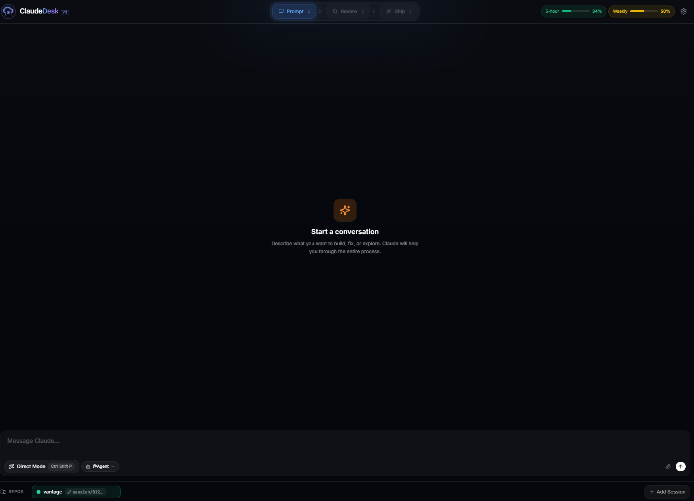

# ClaudeDesk

[](https://www.npmjs.com/package/claudedesk)
[](https://opensource.org/licenses/MIT)
[](https://nodejs.org/)

A web interface for Claude Code with session persistence, visual tool activity, and safe shipping workflows.

**See what Claude does. Review before you ship.**

### Screenshots


*Welcome screen - start a new session, resume existing work, or import conversations*


*Active session with conversation panel, activity timeline, and change tracking*

## Important Security Information

**ClaudeDesk grants Claude Code autonomous access to your local file system and command execution.**

By default, Claude can:
- Read, edit, and delete files in configured workspaces
- Execute arbitrary shell commands on your machine
- Install packages and modify system configuration
- Access network resources and external APIs

**Before using ClaudeDesk:**
- Only configure trusted repositories in workspaces
- Review all changes before committing or deploying
- Use read-only permission mode when exploring unfamiliar codebases
- Keep ClaudeDesk bound to localhost (default) unless you specifically need remote access
- Never configure system directories or sensitive paths
- Never run ClaudeDesk with elevated privileges unless absolutely necessary

ClaudeDesk is designed for development environments. Use production deployments with caution.

## What is ClaudeDesk?

ClaudeDesk is a companion interface for developers who already use Claude Code CLI. It provides visual oversight of AI actions, persistent sessions you can resume anytime, and a structured workflow for reviewing and shipping changes safely.

It is not an IDE. It is not a replacement for Claude Code. It is a session manager that gives you control and visibility.

## Features

- **Session Management** - Create, persist, resume, search, and export Claude Code sessions
- **Visual Tool Timeline** - See every Read, Edit, Bash action in real-time as Claude works
- **Git Worktree Isolation** - Each session runs in its own worktree branch for safe experimentation
- **Ship Workflow** - Review diffs, commit, push, and create PRs in one guided flow
- **Multi-Repo Sessions** - Work across multiple repositories from a single interface
- **Quota Tracking** - Monitor your Claude API usage and costs
- **GitHub/GitLab OAuth** - Push and create PRs using OAuth tokens
- **Plan Mode** - Review and approve Claude's plan before execution
- **Message Queue** - Queue up to 10 messages while Claude is working, with queue manager to preview, reorder, and remove pending prompts
- **Stop/Cancel** - Stop Claude mid-generation with Escape key or Stop button; partial responses are preserved with cancellation marker
- **Queue Resume Controls** - After stopping, choose to resume queue processing or clear all pending messages

## Keyboard Shortcuts

| Shortcut | Action |
|----------|--------|
| **Escape** | Stop Claude's current generation (preserves partial response) |
| **Enter** | Send message (in composer) |
| **Shift+Enter** | New line in composer |

## Installation

### Option 1: npm (Recommended)

```bash
# Install globally
npm install -g claudedesk
claudedesk

# Or run without installing
npx claudedesk
```

**Prerequisites:** Node.js 18+ and [Claude Code CLI](https://docs.anthropic.com/en/docs/claude-code)

### Option 2: Docker

```bash
cd deploy
cp .env.example .env
docker compose up -d
```

See [deploy/README.md](deploy/README.md) for full Docker deployment instructions.

**Prerequisites:** Docker Engine 20.10+ and Docker Compose 2.0+

### Option 3: From Source (Development)

```bash
git clone https://github.com/carloluisito/claudedesk.git
cd claude-desk
npm install
npm run dev
```

**Prerequisites:** Node.js 18+, npm, Git, and [Claude Code CLI](https://docs.anthropic.com/en/docs/claude-code)

## CLI Reference

```
claudedesk [options]

Options:
  -p, --port <port>      Port to listen on (default: 8787)
  -d, --data-dir <path>  Data directory for config and artifacts
  --skip-wizard          Skip the initial setup wizard
  --allow-remote         Allow remote network access (binds to 0.0.0.0)
  -h, --help             Show help message
  -v, --version          Show version number
```

### Examples

```bash
# Start on default port
claudedesk

# Start on custom port
claudedesk --port 3000

# Use custom data directory
claudedesk --data-dir /opt/claudedesk-data

# Skip setup wizard (for automated deployments)
claudedesk --skip-wizard

# Allow remote access (see security warning below)
claudedesk --allow-remote --port 8080
```

### Remote Access Security Warning

By default, ClaudeDesk binds to `127.0.0.1` (localhost only). Using `--allow-remote` binds to `0.0.0.0`, exposing ClaudeDesk to your entire network.

**Risks of `--allow-remote`:**
- Anyone on your network can access the ClaudeDesk interface
- With your auth token, they can access your configured repositories
- Claude can execute arbitrary commands on your machine
- Your code and file system are exposed

**Only use `--allow-remote` when:**
- You are on a trusted private network
- You have additional authentication/firewall in place
- You specifically need mobile or remote access

**Safer alternative:** Use the built-in tunnel feature for secure remote access without exposing your local network.

## Configuration

### Data Directory

ClaudeDesk stores all configuration and data in a dedicated directory:

**Default locations:**
- Linux/macOS: `~/.claudedesk`
- Windows: `%APPDATA%\claudedesk`

**Custom location:**
```bash
claudedesk --data-dir /custom/path
# Or via environment variable
export CLAUDEDESK_DATA_DIR=/custom/path
```

**Directory structure:**
```
.claudedesk/
  config/
    settings.json        # App settings
    repos.json           # Repository configuration
    workspaces.json      # Workspace definitions
    skills/              # Custom Claude skills
    usage/               # API usage tracking
  artifacts/             # Session artifacts and exports
```

### Environment Variables

ClaudeDesk can be configured via environment variables:

| Variable | Default | Description |
|----------|---------|-------------|
| `CLAUDEDESK_PORT` | 8787 | Port to listen on |
| `CLAUDEDESK_DATA_DIR` | `~/.claudedesk` | Data directory path |
| `ALLOW_REMOTE` | false | Set to `true` for remote access |
| `GITHUB_CLIENT_ID` | - | GitHub OAuth client ID |
| `GITHUB_CLIENT_SECRET` | - | GitHub OAuth client secret |
| `GITLAB_CLIENT_ID` | - | GitLab OAuth client ID |
| `GITLAB_CLIENT_SECRET` | - | GitLab OAuth client secret |

Example:
```bash
CLAUDEDESK_PORT=3000 ALLOW_REMOTE=true claudedesk
```

### Workspaces

Configure your repositories in `config/repos.json` (inside your data directory):

```json
{
  "allowedBasePaths": ["/path/to/repos"],
  "repos": [
    {
      "id": "my-project",
      "path": "/path/to/repos/my-project"
    }
  ]
}
```

### GitHub OAuth (Optional)

To enable push and PR creation via OAuth:

1. Create a GitHub OAuth App at https://github.com/settings/developers
2. Set the callback URL to `http://localhost:<PORT>/api/auth/github/callback`
   - Replace `<PORT>` with your configured port (default: 8787)
3. Add credentials to your environment:

```bash
export GITHUB_CLIENT_ID=your_client_id
export GITHUB_CLIENT_SECRET=your_client_secret
```

### GitLab OAuth (Optional)

1. Create a GitLab Application at https://gitlab.com/-/user_settings/applications
2. Set the callback URL to `http://localhost:<PORT>/api/auth/gitlab/callback`
   - Replace `<PORT>` with your configured port (default: 8787)
3. Add credentials to your environment:

```bash
export GITLAB_CLIENT_ID=your_client_id
export GITLAB_CLIENT_SECRET=your_client_secret
```

### Claude API Token Configuration

ClaudeDesk can display your Claude API usage quota in the terminal interface. This requires access to your Claude OAuth token.

**Auto-detection (Recommended)**

If you have Claude Code CLI installed and authenticated, ClaudeDesk automatically detects your token from these locations:

- `~/.claude/.credentials.json` (standard)
- `~/.claude/.credentials` (Windows, no extension)
- `~/.claude/credentials.json` (legacy)

**Manual Configuration**

If auto-detection doesn't work (e.g., token stored elsewhere), you can manually configure it:

1. Go to **Settings > API Configuration**
2. Expand "How to Get Your Claude API Token" for instructions
3. Paste your token and click **Test Token**
4. If valid, click **Save Token**

The token is encrypted using AES-256-GCM before being stored locally.

**Token Priority**

When fetching usage quota, ClaudeDesk checks in this order:
1. Manual token from Settings (if configured)
2. Auto-detected token from credential files
3. No token (quota tracking disabled)

## API Reference

### Health Check

**GET `/api/health`**

Returns server health status and version information. Used for Docker healthchecks and monitoring.

```json
{
  "success": true,
  "data": {
    "status": "ok",
    "version": "2.0.0",
    "uptime": 12345,
    "timestamp": "2024-01-27T12:00:00.000Z"
  }
}
```

### Ship Workflow Endpoints

These endpoints power the commit, push, and PR creation workflow.

#### Get Ship Summary

**GET `/api/terminal/sessions/:id/ship-summary`**

Returns the current state of changes ready to ship.

Query parameters:
- `repoId` (optional) - For multi-repo sessions

```json
{
  "files": [
    {
      "path": "src/index.ts",
      "status": "modified",
      "insertions": 10,
      "deletions": 3,
      "oldPath": null
    }
  ],
  "totalInsertions": 10,
  "totalDeletions": 3,
  "currentBranch": "feature/my-feature",
  "baseBranch": "main",
  "hasUncommittedChanges": true,
  "hasChangesToShip": true,
  "unpushedCommits": 0,
  "hasStagedChanges": false,
  "hasUnstagedChanges": true,
  "existingPR": null
}
```

#### Generate PR Content

**POST `/api/terminal/sessions/:id/generate-pr-content`**

Uses AI to generate a PR title and description based on the changes.

Request body:
```json
{
  "repoId": "optional-repo-id",
  "targetBranch": "main"
}
```

Response:
```json
{
  "title": "Add user authentication flow",
  "description": "## Summary\n- Implements login/logout functionality\n- Adds session management\n\n## Changes\n- New auth middleware\n- Updated routes"
}
```

#### Ship Changes

**POST `/api/terminal/sessions/:id/ship`**

Commits, pushes, and optionally creates a PR.

Request body:
```json
{
  "commitMessage": "Add user authentication",
  "push": true,
  "createPR": true,
  "prTitle": "Add user authentication flow",
  "prBody": "## Summary\n...",
  "targetBranch": "main",
  "repoId": "optional-repo-id"
}
```

Response:
```json
{
  "success": true,
  "committed": true,
  "pushed": true,
  "prUrl": "https://github.com/user/repo/pull/123",
  "commitHash": "abc1234"
}
```

For complete API documentation, see [ARCHITECTURE.md](ARCHITECTURE.md).

## Troubleshooting

### Installation Issues

**"Permission denied" when installing globally**
```bash
# Use npx instead (no global install needed)
npx claudedesk

# Or fix npm permissions (Linux/macOS)
sudo npm install -g claudedesk
```

**"Command not found: claudedesk"**
```bash
# Check npm global bin directory is in PATH
npm config get prefix
# Add to PATH if needed:
export PATH="$PATH:$(npm config get prefix)/bin"

# Or use npx
npx claudedesk
```

### Runtime Issues

**"Port 8787 already in use"**
```bash
claudedesk --port 3000
```

**"Cannot create data directory"**
```bash
# Check permissions
ls -la ~/.claudedesk

# Use custom location with write access
claudedesk --data-dir ./my-data
```

**"Claude CLI not found"**

ClaudeDesk requires Claude Code CLI for terminal sessions. Install it from:
https://docs.anthropic.com/en/docs/claude-code

ClaudeDesk will show a warning but continue running without terminal features if Claude CLI is not found.

## Data Migration

### Backing Up Your Data

```bash
# Linux/macOS
tar -czf claudedesk-backup.tar.gz ~/.claudedesk

# Windows (PowerShell)
Compress-Archive -Path "$env:APPDATA\claudedesk" -DestinationPath claudedesk-backup.zip
```

### Restoring Data

```bash
# Linux/macOS
tar -xzf claudedesk-backup.tar.gz -C ~

# Or specify custom location
claudedesk --data-dir /path/to/restored/data
```

## Architecture

```
src/
  api/           # Express routes
  core/          # Claude invoker, git operations, session management
  config/        # Settings, workspaces, skills
  ui/app/        # React frontend
config/
  repos.json     # Repository configuration (example)
  skills/        # Custom skill definitions
deploy/
  docker-compose.yml  # Production Docker deployment
```

## Contributing

Contributions welcome. Please open an issue first to discuss significant changes.

See [CONTRIBUTING.md](CONTRIBUTING.md) for development setup and guidelines.

## License

MIT
