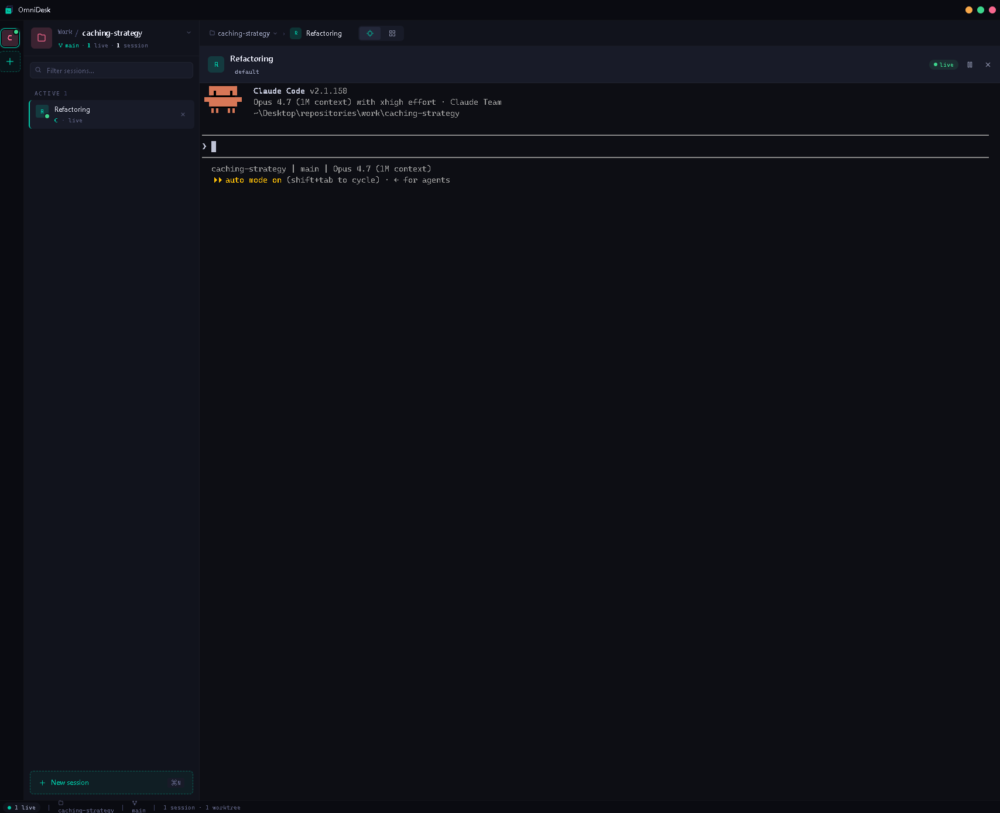
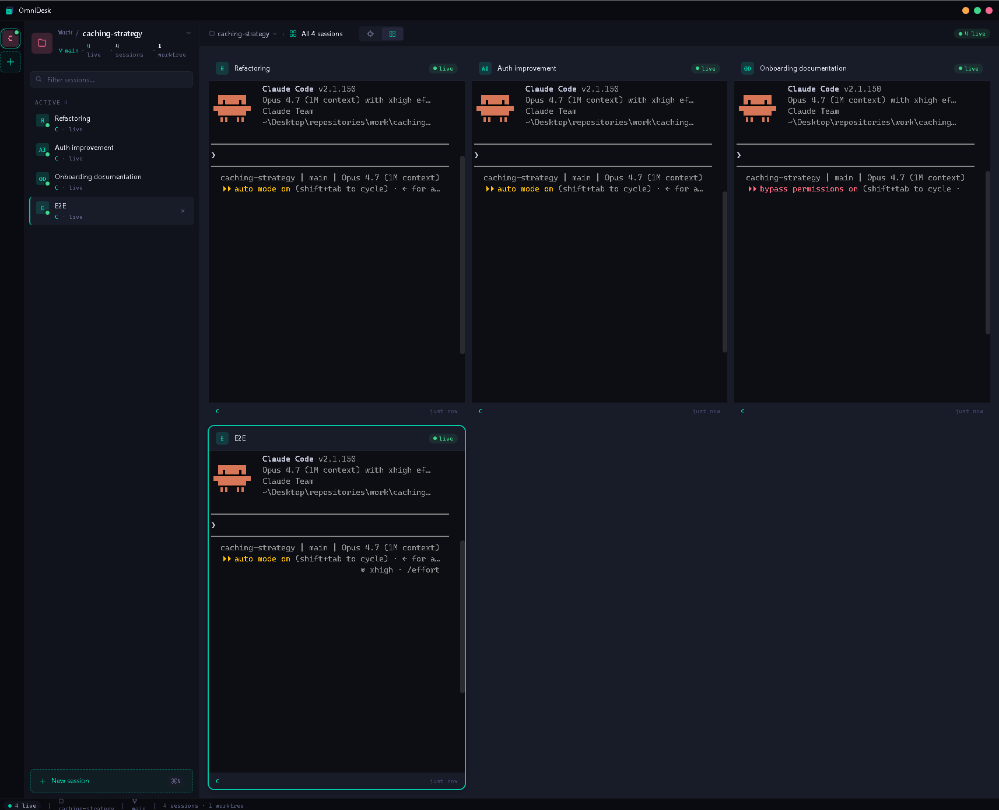
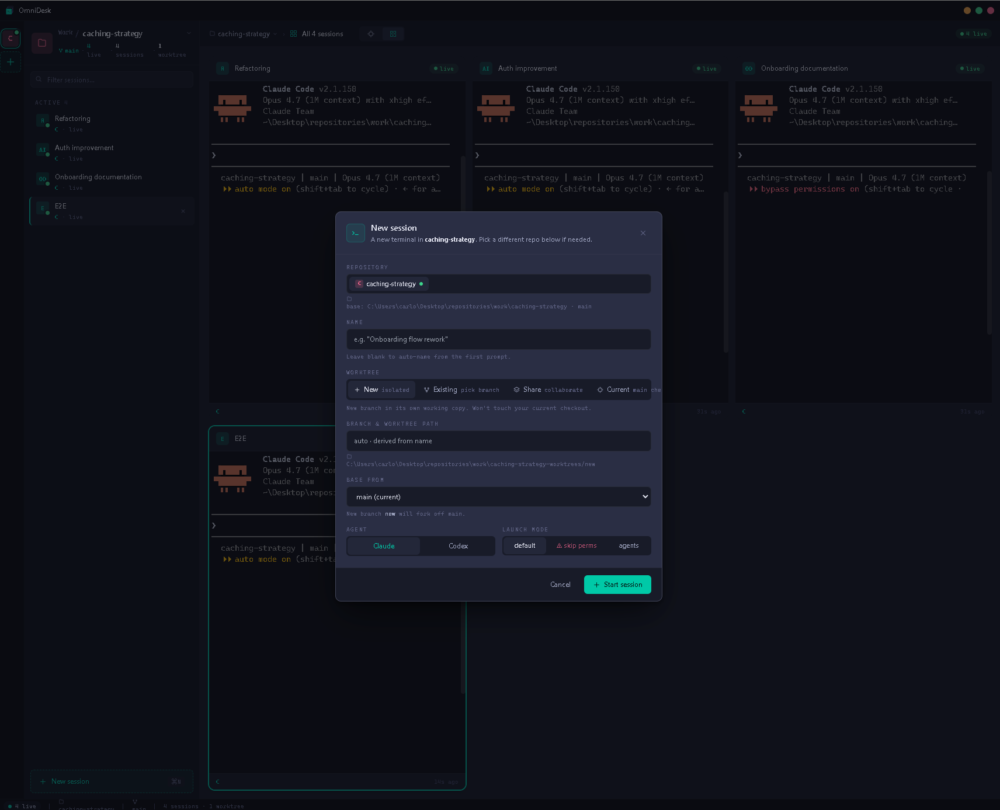
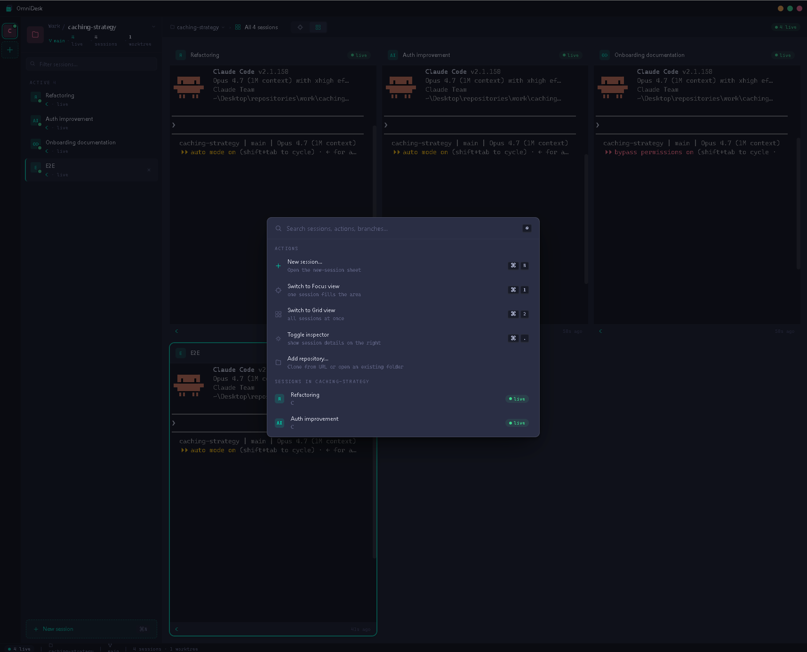
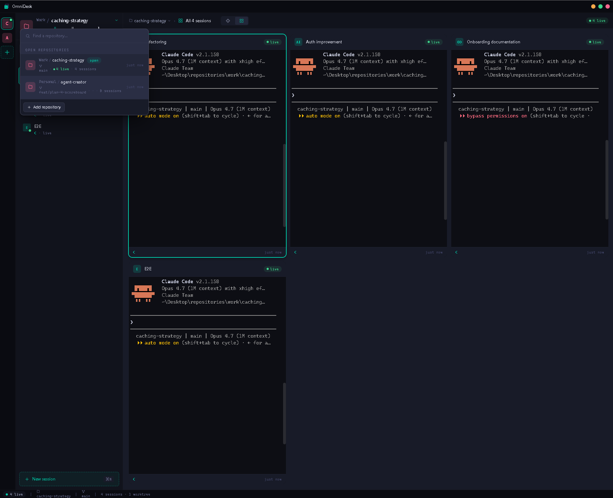

# OmniDesk


> A multi-provider desktop terminal for AI coding CLIs, organized around a flat **repo → session** workflow.

**OmniDesk** is an Electron-based desktop application that wraps AI coding CLIs (Claude Code, Codex CLI, and more) in a clean, fast terminal shell. Switch repositories from a left activity bar, navigate the sessions inside each repo from a session rail, and run every session in a full xterm.js terminal — focus a single session, or view them all at once in a grid.



---

## Screenshots

<table>
<tr>
<td width="50%">

**Grid View** — See every session in a repo at once as live tiles, then click to focus.



</td>
<td width="50%">

**New Session** — Pick a repo, a session type (agent or terminal), provider, worktree mode, and (for Claude) a per-session launch mode.



</td>
</tr>
<tr>
<td width="50%">

**Command Palette** — `Ctrl/Cmd+K` for quick actions: new session, switch view, toggle inspector, add repo.



</td>
<td width="50%">

**Repo Switcher** — `Ctrl/Cmd+Shift+K` to jump between repositories and their sessions.



</td>
</tr>
</table>

---

## Features

### Repo → Session Workflow
- **Activity bar** — switch between repositories from the left rail; drag repos together to form groups
- **Session rail** — per-repo list of sessions for fast navigation
- **Focus & Grid modes** — focus a single session full-screen, or view all sessions in a repo as live tiles
- **Right inspector** — collapsible panel with per-session details (provider, branch, working directory)

### Multi-Session Management
- **Multiple concurrent sessions** per repository
- **Named sessions** for better organization
- **Session persistence** — sessions are restored after an app restart
- **Pre-warmed session pool** for fast session creation
- **Per-session launch mode picker** (Claude) — choose between `claude`, `claude --dangerously-skip-permissions`, or `claude agents` (the Claude Code 2.1.139+ background-session TUI) at creation time, gated by an automatic CLI availability probe
- **Plain terminal sessions** — pick the **Terminal** session type to run an ordinary shell (no AI CLI) for `git`, builds, and everyday commands. Create one standalone, or spawn one seeded to an agent's working directory via **Open terminal here** on the session context menu

### Multi-Provider Support
- **Pluggable provider layer** — swap between Claude Code, Codex CLI, and future providers
- **Provider selector** in the new-session sheet — choose Claude or Codex for each agent session
- **Provider badges** on sessions to distinguish non-default providers
- **Auto-detection** — providers register automatically based on installed CLI binaries

### Worktree-Aware Sessions
- **Open any folder** — add a git repository or a plain (non-git) folder; when the folder isn't a repo, OmniDesk offers to initialize git
- **Create a session on a new git worktree/branch, an existing branch, or the current checkout**
- **Background git operations** — status, branches, and worktree management run in the main process (no separate Git panel to manage)
- **Optional cleanup** — remove the worktree/branch when you close the session

### Command Palette & Repo Switcher
- **Command palette** (`Ctrl/Cmd+K`) for quick actions — new session, switch to Focus/Grid, toggle the inspector, add a repository
- **Repo switcher** (`Ctrl/Cmd+Shift+K`) to jump between repositories and their sessions

### Attention Cockpit
- **Live session status** on the rail — each session is classified (`working` / `awaiting-approval` / `errored` / `done` / `idle`) rather than a single "running" state
- **"Who needs you" cockpit** (`Ctrl/Cmd+J`) — a cross-repo overlay listing sessions that need attention, with Jump/Dismiss, plus a "N need you" pill in the status bar and background toasts for backgrounded sessions
- **Current scope** — live-state classification is available for **plain terminal (shell) sessions** today; agent-CLI (Claude Code / Codex) live-state classification is in progress (their full-screen TUIs need a screen-aware classifier). Agent sessions still surface run/error/exit state.

### Quota Awareness
- **Burn-rate indicator** in the status bar, backed by the Anthropic API quota service

### Voice Prompting (Speech-to-Text)
- **Dictate prompts instead of typing** — click the mic button in the terminal (or press `Ctrl+Shift+Space`) to start recording, click/press again to stop
- **Fully on-device** — transcription runs a local Whisper model (via transformers.js WASM) in a sandboxed background process; audio never leaves your machine, no cloud service, no API keys
- **Review before sending** — the transcript appears in an editable overlay so you can fix wording before it's injected into the terminal
- **Live feedback** — an audio-reactive equalizer while recording, so a muted or dead mic is immediately obvious
- **Model choice** — pick `tiny.en`, `base.en` (default), or `small.en` from the voice settings panel (`Ctrl/Cmd+K → "Voice / speech-to-text settings…"`); the model downloads once, with your consent, and is cached locally
- Right-click the mic button to hide it; disabled for remote (browser) clients

### Remote Access
- **Reach OmniDesk from any browser** — the same UI runs on your phone, tablet, or another computer, driving your live sessions
- **One-click managed tunnel** — OmniDesk runs a Cloudflare tunnel for you (auto-downloads `cloudflared` on request); no manual terminal setup
- **Live mirror** — output fans out to every connected device; type a prompt anywhere and it shows up everywhere, with terminal history replayed on connect
- **Token-secured** — binds `127.0.0.1` only and enforces its own access token (cookie + WebSocket check); off by default
- **One-scan sign-in + installable PWA** — a QR whose link embeds the token signs you in on one scan, and you can **Add to Home Screen / Install** for a full-screen app that stays signed in across launches
- **Built for touch** — on a phone the UI switches to a focused mobile layout: a drawer to **switch between projects and sessions** (and open a new project) over a full-screen terminal. Tapping the terminal raises the keyboard, and an on-screen key bar sends Esc, Tab, Ctrl-combos, arrows, and newline so you can actually work from a phone
- Open it from the activity-bar tunnel button or `Ctrl/Cmd+K → "Remote access…"`

### Terminal Features
- **Full xterm.js terminal** with rich text formatting
- **Clickable links** — URLs are automatically detected and open in your browser
- **Copy/paste support** with keyboard shortcuts
- **Newline insertion** — in agent sessions, `Ctrl/Shift/Alt/Cmd+Enter` inserts a literal newline without submitting
- **Ctrl+C guard** — in agent sessions, a confirmation dialog prevents accidentally exiting the CLI; in plain terminal sessions, `Ctrl+C` passes straight through to interrupt the running command
- **Kitty keyboard protocol** — accurate key/modifier encoding, negotiated automatically when the running CLI requests it
- **Obsidian dark theme** with the JetBrains Mono font

---

## Prerequisites

Before installing OmniDesk, ensure you have:

1. **Node.js 20+** — [Download here](https://nodejs.org/)
2. **Claude Code CLI** — Install via:
   ```bash
   npm install -g @anthropic-ai/claude-code
   ```
   Or follow the [official installation guide](https://claude.ai/claude-code)
3. **Claude API credentials** — OmniDesk reads from `~/.claude/.credentials.json` (set up by Claude CLI)

> **Optional:** install the [Codex CLI](https://github.com/openai/codex) to enable the Codex provider — OmniDesk detects it automatically.

> **Remote Access (optional):** no extra install needed — OmniDesk offers to download `cloudflared` for you when you start the managed tunnel. Requires an internet connection for the Cloudflare tunnel. If you run from source, launch via `npm start` (not a dev command) so the built UI exists for the remote server to serve.

---

## Installation

### Option 1: Download Pre-built Binary (Recommended)

Download the latest release for your platform from the [Releases](https://github.com/carloluisito/omnidesk/releases) page.

- **Windows**: `.exe` installer
- **macOS**: `.dmg`
- **Linux**: `.AppImage` or `.deb`

### Option 2: Build from Source

```bash
# Clone the repository
git clone https://github.com/carloluisito/omnidesk.git
cd omnidesk

# Install dependencies
npm install

# Run in development mode
npm run electron:dev

# Or build for production
npm run package
```

**Build for specific platforms:**
```bash
npm run package:win    # Windows
npm run package:mac    # macOS
npm run package:linux  # Linux
```

Built packages will be in the `release/` directory.

---

## Quick Start

1. **Launch OmniDesk** from your applications menu or run `npm run electron:dev`
2. **Add a repository** — use the **+** button on the activity bar to clone a repo or open an existing folder
3. **Create a session** — press `Ctrl/Cmd+N` (or use the **+ New Session** affordance), pick a repo, provider, and worktree mode
4. **Start working** — type your prompt in the terminal
5. **Switch views** — `Ctrl/Cmd+1` for Focus (one session), `Ctrl/Cmd+2` for Grid (all sessions)
6. **Open the command palette** — press `Ctrl/Cmd+K` for quick actions

---

## Keyboard Shortcuts

| Shortcut | Action |
|----------|--------|
| `Ctrl/Cmd+N` | New Session |
| `Ctrl/Cmd+K` | Command Palette |
| `Ctrl/Cmd+J` | Attention cockpit ("who needs you") |
| `Ctrl/Cmd+Shift+K` | Repo Switcher |
| `Ctrl/Cmd+1` | Focus View |
| `Ctrl/Cmd+2` | Grid View |
| `Ctrl/Cmd+.` | Toggle Right Inspector |
| `Escape` | Close Palette / Sheets |
| `Ctrl+C` | Session Termination Dialog |
| `Ctrl/Shift/Alt/Cmd+Enter` | Insert newline (without submitting) |

---

## Tech Stack

| Layer | Technology |
|-------|-----------|
| Framework | Electron 28 |
| Frontend | React 18 + TypeScript |
| Terminal | xterm.js + node-pty |
| Styling | Tailwind CSS (Obsidian theme) |
| Build | Vite + electron-builder |
| Testing | Vitest 4 (670 tests) + Playwright |

---

## Architecture

OmniDesk uses a **3-layer pattern per domain**: Manager (main process) → Hook (renderer) → Components (renderer).

```
┌─────────────────────────────────────────────┐
│  Main Process (Node.js)                     │
│  ~7 managers + IPC handlers + session pool  │
└──────────────────┬──────────────────────────┘
                   │ IPC (115 methods)
┌──────────────────┴──────────────────────────┐
│  Preload (auto-derived context bridge)      │
└──────────────────┬──────────────────────────┘
                   │
┌──────────────────┴──────────────────────────┐
│  Renderer (React 18)                        │
│  Hooks → Shell components → Terminal        │
└─────────────────────────────────────────────┘
```

The **IPC contract** (`src/shared/ipc-contract.ts`) is the single source of truth — one entry auto-derives the channel, the preload bridge method, and the TypeScript types. A **provider abstraction** (`IProvider`) decouples CLI specifics from session management, so adding a new AI CLI is a self-contained provider.

```
omnidesk/
├── src/
│   ├── main/              # Electron main process (~7 managers)
│   ├── preload/           # Context bridge (auto-derived from contract)
│   ├── renderer/          # React app (shell components, hooks, utils)
│   └── shared/            # IPC contract, types, shared utilities
├── test/                  # Test setup and helpers
├── e2e/                   # Playwright E2E tests
├── docs/                  # Documentation and screenshots
└── .github/workflows/     # CI pipeline
```

See [docs/repo-index.md](docs/repo-index.md) for a detailed domain-to-file mapping.

---

## Development

```bash
npm install              # Install dependencies
npm run electron:dev     # Dev mode with hot reload (renderer)
npm test                 # Run all 670 tests
npm run test:watch       # Watch mode
npm run test:e2e         # E2E tests (local only — requires a built app)
npm run test:coverage    # Coverage report
```

> **Note:** `npm run build` rebuilds only the renderer. The main process is built separately by `npm run build:electron`. `npm start` chains both before launching Electron — useful before running E2E tests, which load the built `dist/main/index.js`.

See [CONTRIBUTING.md](CONTRIBUTING.md) for development guidelines.

---

## Privacy & Security

- **Local-first** — all session data is stored on your machine
- **No telemetry** — no usage data is collected or transmitted
- **Minimal external services** — network calls are limited to: Anthropic's API (quota/burn-rate), GitHub (app update checks via `electron-updater`), your configured git remotes (clone/fetch/push), and Hugging Face (one-time, user-consented voice model download). Nothing else is contacted.
- **Voice stays local** — speech-to-text runs entirely on-device; audio is never uploaded anywhere
- **Credential security** — reads Claude CLI credentials locally, never logs or stores them

For more details, see [SECURITY.md](SECURITY.md).

---

## Known Issues

- **Windows**: `cmd.exe` is used as the default shell. Ensure `claude` is in your PATH.
- **macOS**: Requires macOS 10.13+ (High Sierra or later).
- **Linux**: May require `libxtst6` and `libnss3` packages.

---

## Contributing

1. **Report bugs** — [Open an issue](https://github.com/carloluisito/omnidesk/issues/new?template=bug_report.md)
2. **Suggest features** — [Request a feature](https://github.com/carloluisito/omnidesk/issues/new?template=feature_request.md)
3. **Submit PRs** — See [CONTRIBUTING.md](CONTRIBUTING.md) for guidelines

Please read our [Code of Conduct](CODE_OF_CONDUCT.md) before contributing.

---

## License

This project is licensed under the **MIT License** — see the [LICENSE](LICENSE) file for details.

```
Copyright (c) 2026 Carlo Luisito Adap
```

---

## Disclaimer

**OmniDesk is an unofficial community project and is not endorsed, affiliated with, or supported by Anthropic.**

This is an independent wrapper around the Claude Code CLI. For official support, refer to [Anthropic's documentation](https://claude.ai/claude-code).

---

## Support

- **Issues**: [GitHub Issues](https://github.com/carloluisito/omnidesk/issues)
- **Security**: See [SECURITY.md](SECURITY.md) for reporting vulnerabilities
- **Email**: carlo.adap@hotmail.com

---

[](https://github.com/carloluisito/omnidesk/stargazers)

**Made with love by [Carlo Luisito Adap](https://github.com/carloluisito)**
